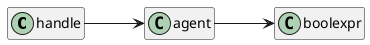

# boolexpr

```plantuml
@startuml
left to right direction

handle --> agent

agent --> boolexpr 

hide members
@enduml
```

Базовый тип для хранения фильтрующих функций. В сообществе его использование не принято, посему вместо него
передавайте . 