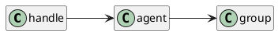

# group

<show-structure for="chapter,procedure" depth="3"/>

Тип `group` встроен в игру и под капотом представляет собой [связанный список](https://w.wiki/7$D5) элементов
типа .

Особенность его реализации такова, что он состоит только из уникальных элементов, то бишь в него невозможно дважды
добавить одного и того же [юнита](unit.md).

> Из-за требования к уникальности содержимого добавление, удаление и поиск элемента выполняются за `O(n)`.

## Функции

<include from="native-group.md" element-id="main"/>