# handle

Ссылки на внутриигровые объекты. Являются [integer](integer.md) и в первом приближении можно относиться к ним как к
[примитивам](data-types.md#primitive).

| Тип                           | Родитель                 | UjAPI | Конвертер                       |
|-------------------------------|--------------------------|-------|---------------------------------|
| ability                       | agent                    |       |                                 |
| abilitybooleanfield           | agentdatafield           | ✅     | ConvertAbilityBooleanField      |
| abilitybooleanlevelarrayfield | abilitybooleanlevelfield | ✅     |                                 |
| abilitybooleanlevelfield      | abilitybooleanfield      | ✅     | ConvertAbilityBooleanLevelField |
| abilityintegerfield           | agentdatafield           | ✅     | ConvertAbilityIntegerField      |
| abilityintegerlevelarrayfield | abilityintegerlevelfield | ✅     |                                 |
| abilityintegerlevelfield      | abilityintegerfield      | ✅     | ConvertAbilityIntegerLevelField |
| abilityrealfield              | agentdatafield           | ✅     | ConvertAbilityRealField         |
| abilityreallevelarrayfield    | abilityreallevelfield    | ✅     |                                 |
| abilityreallevelfield         | abilityrealfield         | ✅     | ConvertAbilityRealLevelField    |
| abilitystringfield            | agentdatafield           | ✅     | ConvertAbilityStringField       |
| abilitystringlevelarrayfield  | abilitystringlevelfield  | ✅     |                                 |
| abilitystringlevelfield       | abilitystringfield       | ✅     | ConvertAbilityStringLevelField  |
| abilitytype                   | flagtype                 | ✅     | ConvertAbilityType              |
| agent                         | handle                   |       |                                 |
| agentdatafield                | handle                   | ✅     |                                 |
| aidifficulty                  | handle                   |       | ConvertAIDifficulty             |
| alliancetype                  | handle                   |       | ConvertAllianceType             |
| animtype                      | mappedtype               | ✅     | ConvertAnimType                 |
| armortype                     | handle                   | ✅     | ConvertArmorType                |
| attachmenttype                | mappedtype               | ✅     | ConvertAttachmentType           |
| attacktype                    | handle                   |       | ConvertAttackType               |
| blendmode                     | handle                   |       | ConvertBlendMode                |
| bonetype                      | attachmenttype           | ✅     | ConvertBoneType                 |
| boolexpr                      | agent                    |       |                                 |
| buff                          | ability                  |       |                                 |
| button                        | agent                    |       |                                 |
| camerafield                   | handle                   |       | ConvertCameraField              |
| camerasetup                   | handle                   |       |                                 |
| collisiontype                 | flagtype                 | ✅     | ConvertCollisionType            |
| commandbuttoneffect           | handle                   | ✅     |                                 |
| conditionfunc                 | boolexpr                 |       |                                 |
| connectiontype                | handle                   | ✅     | ConvertConnectionType           |
| controlstyleflag              | flagtype                 | ✅     | ConvertControlStyleFlag         |
| cursoranimtype                | mappedtype               | ✅     | ConvertCursorAnimType           |
| damagetype                    | handle                   |       | ConvertDamageType               |
| defeatcondition               | agent                    |       |                                 |
| defensetype                   | handle                   | ✅     | ConvertDefenseType              |
| destructable                  | widget                   |       |                                 |
| destructablestringfield       | agentdatafield           | ✅     | ConvertDestructableStringField  |
| dialog                        | agent                    |       |                                 |
| dialogevent                   | eventid                  |       | ConvertDialogEvent              |
| doodad                        | war3image                | ✅     |                                 |
| effect                        | war3image                |       |                                 |
| effecttype                    | handle                   |       | ConvertEffectType               |
| event                         | agent                    |       |                                 |
| eventid                       | handle                   |       |                                 |
| fgamestate                    | gamestate                |       | ConvertFGameState               |
| filterfunc                    | boolexpr                 |       |                                 |
| flagtype                      | handle                   | ✅     |                                 |
| fogmodifier                   | agent                    |       |                                 |
| fogstate                      | handle                   |       | ConvertFogState                 |
| force                         | agent                    |       |                                 |
| frameeventtype                | handle                   | ✅     | ConvertFrameEventType           |
| framehandle                   | handle                   | ✅     |                                 |
| framepointtype                | handle                   | ✅     | ConvertFramePointType           |
| framestate                    | flagtype                 | ✅     | ConvertFrameState               |
| gamecache                     | agent                    |       |                                 |
| gamedifficulty                | handle                   |       | ConvertGameDifficulty           |
| gameevent                     | eventid                  |       | ConvertGameEvent                |
| gamespeed                     | handle                   |       | ConvertGameSpeed                |
| gamestate                     | handle                   |       |                                 |
| gametype                      | flagtype                 |       | ConvertGameType                 |
| gridstyleflag                 | flagtype                 | ✅     | ConvertGridStyleFlag            |
| group                         | agent                    |       |                                 |
| handlelist                    | handle                   | ✅     |                                 |
| hashtable                     | agent                    |       |                                 |
| heroattribute                 | handle                   | ✅     | ConvertHeroAttribute            |
| igamestate                    | gamestate                |       | ConvertIGameState               |
| image                         | handle                   |       |                                 |
| item                          | widget                   |       |                                 |
| itembooleanfield              | agentdatafield           | ✅     | ConvertItemBooleanField         |
| itemintegerfield              | agentdatafield           | ✅     | ConvertItemIntegerField         |
| itempool                      | handle                   |       |                                 |
| itemrealfield                 | agentdatafield           | ✅     | ConvertItemRealField            |
| itemstringfield               | agentdatafield           | ✅     | ConvertItemStringField          |
| itemtype                      | handle                   |       | ConvertItemType                 |
| jassthread                    | handle                   | ✅     |                                 |
| layerstyleflag                | flagtype                 | ✅     | ConvertLayerStyleFlag           |
| layoutstyleflag               | flagtype                 | ✅     | ConvertLayoutStyleFlag          |
| leaderboard                   | agent                    |       |                                 |
| lightning                     | handle                   |       |                                 |
| limitop                       | eventid                  |       | ConvertLimitOp                  |
| location                      | agent                    |       |                                 |
| mapcontrol                    | handle                   |       | ConvertMapControl               |
| mapdensity                    | handle                   |       | ConvertMapDensity               |
| mapflag                       | flagtype                 |       | ConvertMapFlag                  |
| mappedfield                   | handle                   | ✅     | ConvertMappedField              |
| mappedtype                    | handle                   | ✅     |                                 |
| mapsetting                    | handle                   |       |                                 |
| mapvisibility                 | handle                   |       |                                 |
| minimapicon                   | handle                   | ✅     |                                 |
| mousebuttontype               | handle                   | ✅     | ConvertMouseButtonType          |
| movetype                      | flagtype                 | ✅     | ConvertMoveType                 |
| multiboard                    | agent                    |       |                                 |
| multiboarditem                | agent                    |       |                                 |
| orderhandle                   | agent                    | ✅     |                                 |
| originframetype               | handle                   | ✅     | ConvertOriginFrameType          |
| oskeytype                     | handle                   | ✅     | ConvertOsKeyType                |
| pathingaitype                 | flagtype                 | ✅     | ConvertPathingAIType            |
| pathingflag                   | flagtype                 | ✅     | ConvertPathingFlag              |
| pathingtype                   | handle                   |       | ConvertPathingType              |
| placement                     | handle                   |       | ConvertPlacement                |
| player                        | agent                    |       |                                 |
| playercolor                   | handle                   |       | ConvertPlayerColor              |
| playerevent                   | eventid                  |       | ConvertPlayerEvent              |
| playergameresult              | handle                   |       | ConvertPlayerGameResult         |
| playerscore                   | handle                   |       | ConvertPlayerScore              |
| playerslotstate               | handle                   |       | ConvertPlayerSlotState          |
| playerstate                   | handle                   |       | ConvertPlayerState              |
| playerunitevent               | eventid                  |       | ConvertPlayerUnitEvent          |
| projectile                    | war3image                | ✅     |                                 |
| projectiletype                | handle                   | ✅     | ConvertProjectileType           |
| quest                         | agent                    |       |                                 |
| questitem                     | agent                    |       |                                 |
| race                          | handle                   |       | ConvertRace                     |
| racepreference                | flagtype                 |       | ConvertRacePref                 |
| raritycontrol                 | handle                   |       | ConvertRarityControl            |
| rect                          | agent                    |       |                                 |
| regentype                     | handle                   | ✅     | ConvertRegenType                |
| region                        | agent                    |       |                                 |
| renderstage                   | handle                   | ✅     | ConvertRenderStage              |
| sound                         | agent                    |       |                                 |
| soundtype                     | handle                   |       | ConvertSoundType                |
| sprite                        | war3image                | ✅     |                                 |
| startlocprio                  | handle                   |       | ConvertStartLocPrio             |
| subanimtype                   | animtype                 | ✅     | ConvertSubAnimType              |
| targetflag                    | flagtype                 | ✅     | ConvertTargetFlag               |
| terraindeformation            | handle                   |       |                                 |
| texmapflags                   | handle                   |       | ConvertTexMapFlags              |
| textaligntype                 | handle                   | ✅     | ConvertTextAlignType            |
| textfilehandle                | handle                   | ✅     |                                 |
| texttag                       | handle                   |       |                                 |
| timer                         | agent                    |       |                                 |
| timerdialog                   | agent                    |       |                                 |
| timetype                      | handle                   | ✅     | ConvertTimeType                 |
| trackable                     | war3image                |       |                                 |
| trigger                       | agent                    |       |                                 |
| triggeraction                 | handle                   |       |                                 |
| triggercondition              | agent                    |       |                                 |
| ubersplat                     | handle                   |       |                                 |
| unit                          | widget                   |       |                                 |
| unitbooleanfield              | agentdatafield           | ✅     | ConvertUnitBooleanField         |
| unitcategory                  | flagtype                 | ✅     | ConvertUnitCategory             |
| unitevent                     | eventid                  |       | ConvertUnitEvent                |
| unitintegerfield              | agentdatafield           | ✅     | ConvertUnitIntegerField         |
| unitpool                      | handle                   |       |                                 |
| unitrealfield                 | agentdatafield           | ✅     | ConvertUnitRealField            |
| unitstate                     | handle                   |       | ConvertUnitState                |
| unitstringfield               | agentdatafield           | ✅     | ConvertUnitStringField          |
| unittype                      | handle                   |       | ConvertUnitType                 |
| unitweaponbooleanfield        | agentdatafield           | ✅     | ConvertUnitWeaponBooleanField   |
| unitweaponintegerfield        | agentdatafield           | ✅     | ConvertUnitWeaponIntegerField   |
| unitweaponrealfield           | agentdatafield           | ✅     | ConvertUnitWeaponRealField      |
| unitweaponstringfield         | agentdatafield           | ✅     | ConvertUnitWeaponStringField    |
| variabletype                  | handle                   | ✅     | ConvertVariableType             |
| version                       | handle                   |       | ConvertVersion                  |
| volumegroup                   | handle                   |       | ConvertVolumeGroup              |
| war3image                     | agent                    | ✅     |                                 |
| weapontype                    | handle                   |       | ConvertWeaponType               |
| weathereffect                 | handle                   |       |                                 |
| widget                        | war3image                |       |                                 |
| widgetevent                   | eventid                  |       | ConvertWidgetEvent              |

## Конвертеры {id="converter"}

```C++
race ConvertRace(uint i)
alliancetype ConvertAllianceType(uint i)
racepreference ConvertRacePref(uint i)
igamestate ConvertIGameState(uint i)
fgamestate ConvertFGameState(uint i)
playerstate ConvertPlayerState(uint i)
playerscore ConvertPlayerScore(uint i)
playergameresult ConvertPlayerGameResult(uint i)
unitstate ConvertUnitState(uint i)
aidifficulty ConvertAIDifficulty(uint i)
gameevent ConvertGameEvent(uint i)
playerevent ConvertPlayerEvent(uint i)
playerunitevent ConvertPlayerUnitEvent(uint i)
widgetevent ConvertWidgetEvent(uint i)
dialogevent ConvertDialogEvent(uint i)
unitevent ConvertUnitEvent(uint i)
limitop ConvertLimitOp(uint i)
unittype ConvertUnitType(uint i)
gamespeed ConvertGameSpeed(uint i)
placement ConvertPlacement(uint i)
startlocprio ConvertStartLocPrio(uint i)
gamedifficulty ConvertGameDifficulty(uint i)
gametype ConvertGameType(uint i)
mapflag ConvertMapFlag(uint i)
mapvisibility ConvertMapVisibility(uint i)
mapsetting ConvertMapSetting(uint i)
mapdensity ConvertMapDensity(uint i)
mapcontrol ConvertMapControl(uint i)
playercolor ConvertPlayerColor(uint i)
playerslotstate ConvertPlayerSlotState(uint i)
volumegroup ConvertVolumeGroup(uint i)
camerafield ConvertCameraField(uint i)
blendmode ConvertBlendMode(uint i)
raritycontrol ConvertRarityControl(uint i)
texmapflags ConvertTexMapFlags(uint i)
fogstate ConvertFogState(uint i)
effecttype ConvertEffectType(uint i)
version ConvertVersion(uint i)
itemtype ConvertItemType(uint i)
attacktype ConvertAttackType(uint i)
damagetype ConvertDamageType(uint i)
weapontype ConvertWeaponType(uint i)
soundtype ConvertSoundType(uint i)
pathingtype ConvertPathingType(uint i)
projectiletype ConvertProjectileType(uint i)
mappedfield ConvertMappedField(uint i)
attachmenttype ConvertAttachmentType(uint i)
bonetype ConvertBoneType(uint i)
animtype ConvertAnimType(uint i)
subanimtype ConvertSubAnimType(uint i)
cursoranimtype ConvertCursorAnimType(uint i)
originframetype ConvertOriginFrameType(uint i)
framepointtype ConvertFramePointType(uint i)
textaligntype ConvertTextAlignType(uint i)
frameeventtype ConvertFrameEventType(uint i)
oskeytype ConvertOsKeyType(uint i)
mousebuttontype ConvertMouseButtonType(uint i)
abilityintegerfield ConvertAbilityIntegerField(uint i)
abilityrealfield ConvertAbilityRealField(uint i)
abilitybooleanfield ConvertAbilityBooleanField(uint i)
abilitystringfield ConvertAbilityStringField(uint i)
abilityintegerlevelfield ConvertAbilityIntegerLevelField(uint i)
abilityreallevelfield ConvertAbilityRealLevelField(uint i)
abilitybooleanlevelfield ConvertAbilityBooleanLevelField(uint i)
abilitystringlevelfield ConvertAbilityStringLevelField(uint i)
abilityintegerlevelarrayfield ConvertAbilityIntegerLevelArrayField(uint i)
abilityreallevelarrayfield ConvertAbilityRealLevelArrayField(uint i)
abilitybooleanlevelarrayfield ConvertAbilityBooleanLevelArrayField(uint i)
abilitystringlevelarrayfield ConvertAbilityStringLevelArrayField(uint i)
destructablestringfield ConvertDestructableStringField(uint i)
itemintegerfield ConvertItemIntegerField(uint i)
itemrealfield ConvertItemRealField(uint i)
itembooleanfield ConvertItemBooleanField(uint i)
itemstringfield ConvertItemStringField(uint i)
unitintegerfield ConvertUnitIntegerField(uint i)
unitrealfield ConvertUnitRealField(uint i)
unitbooleanfield ConvertUnitBooleanField(uint i)
unitstringfield ConvertUnitStringField(uint i)
unitweaponintegerfield ConvertUnitWeaponIntegerField(uint i)
unitweaponrealfield ConvertUnitWeaponRealField(uint i)
unitweaponbooleanfield ConvertUnitWeaponBooleanField(uint i)
unitweaponstringfield ConvertUnitWeaponStringField(uint i)
movetype ConvertMoveType(uint i)
pathingaitype ConvertPathingAIType(uint i)
collisiontype ConvertCollisionType(uint i)
targetflag ConvertTargetFlag(uint i)
armortype ConvertArmorType(uint i)
heroattribute ConvertHeroAttribute(uint i)
defensetype ConvertDefenseType(uint i)
regentype ConvertRegenType(uint i)
unitcategory ConvertUnitCategory(uint i)
pathingflag ConvertPathingFlag(uint i)
timetype ConvertTimeType(uint i)
variabletype ConvertVariableType(uint i)
renderstage ConvertRenderStage(uint i)
layoutstyleflag ConvertLayoutStyleFlag(uint i)
gridstyleflag ConvertGridStyleFlag(uint i)
layerstyleflag ConvertLayerStyleFlag(uint i)
controlstyleflag ConvertControlStyleFlag(uint i)
framestate ConvertFrameState(uint i)
abilitytype ConvertAbilityType(uint i)
connectiontype ConvertConnectionType(uint i)
```

## Граф зависимостей

```plantuml
@startjson
{
    "handle": {
        "agent": {
            "event": "",
            "player": "",
            "war3image": {
                "widget": {
                    "unit": "",
                    "destructable": "",
                    "item": ""
                },
                "effect": "",
                "trackable": "",
                "sprite": "",
                "projectile": "",
                "doodad": ""
            },
            "ability": {
                "buff": ""
            },
            "force": "",
            "group": "",
            "trigger": "",
            "triggercondition": "",
            "timer": "",
            "location": "",
            "region": "",
            "rect": "",
            "boolexpr": {
                "conditionfunc": "",
                "filterfunc": ""
            },
            "sound": "",
            "fogmodifier": "",
            "dialog": "",
            "button": "",
            "quest": "",
            "questitem": "",
            "defeatcondition": "",
            "timerdialog": "",
            "leaderboard": "",
            "multiboard": "",
            "multiboarditem": "",
            "gamecache": "",
            "hashtable": "",
            "orderhandle": ""
        },
        "triggeraction": "",
        "unitpool": "",
        "itempool": "",
        "race": "",
        "alliancetype": "",
        "gamestate": {
            "igamestate": "",
            "fgamestate": ""
        },
        "playerstate": "",
        "playerscore": "",
        "playergameresult": "",
        "unitstate": "",
        "aidifficulty": "",
        "eventid": {
            "gameevent": "",
            "playerevent": "",
            "playerunitevent": "",
            "unitevent": "",
            "limitop": "",
            "widgetevent": "",
            "dialogevent": ""
        },
        "unittype": "",
        "projectiletype": "",
        "gamespeed": "",
        "gamedifficulty": "",
        "mapvisibility": "",
        "mapsetting": "",
        "mapdensity": "",
        "mapcontrol": "",
        "minimapicon": "",
        "playerslotstate": "",
        "volumegroup": "",
        "camerafield": "",
        "camerasetup": "",
        "playercolor": "",
        "placement": "",
        "startlocprio": "",
        "raritycontrol": "",
        "blendmode": "",
        "texmapflags": "",
        "effecttype": "",
        "weathereffect": "",
        "terraindeformation": "",
        "fogstate": "",
        "version": "",
        "itemtype": "",
        "texttag": "",
        "attacktype": "",
        "damagetype": "",
        "weapontype": "",
        "soundtype": "",
        "lightning": "",
        "pathingtype": "",
        "mappedfield": "",
        "mappedtype": {
            "attachmenttype": {
                "bonetype": ""
            },
            "animtype": {
                "subanimtype": ""
            },
            "cursoranimtype": ""
        },
        "image": "",
        "ubersplat": "",
        "framehandle": "",
        "commandbuttoneffect": "",
        "originframetype": "",
        "framepointtype": "",
        "textaligntype": "",
        "frameeventtype": "",
        "oskeytype": "",
        "mousebuttontype": "",
        "agentdatafield": {
            "abilityintegerfield": {
                "abilityintegerlevelfield": {
                    "abilityintegerlevelarrayfield": ""
                }
            },
            "abilityrealfield": {
                "abilityreallevelfield": {
                    "abilityreallevelarrayfield": ""
                }
            },
            "abilitybooleanfield": {
                "abilitybooleanlevelfield": {
                    "abilitybooleanlevelarrayfield": ""
                }
            },
            "abilitystringfield": {
                "abilitystringlevelfield": {
                    "abilitystringlevelarrayfield": ""
                }
            },
            "destructablestringfield": "",
            "itemintegerfield": "",
            "itemrealfield": "",
            "itembooleanfield": "",
            "itemstringfield": "",
            "unitintegerfield": "",
            "unitrealfield": "",
            "unitbooleanfield": "",
            "unitstringfield": "",
            "unitweaponintegerfield": "",
            "unitweaponrealfield": "",
            "unitweaponbooleanfield": "",
            "unitweaponstringfield": ""
        },
        "flagtype": {
            "racepreference": "",
            "gametype": "",
            "mapflag": "",
            "movetype": "",
            "pathingaitype": "",
            "collisiontype": "",
            "targetflag": "",
            "unitcategory": "",
            "pathingflag": "",
            "layoutstyleflag": "",
            "gridstyleflag": "",
            "layerstyleflag": "",
            "controlstyleflag": "",
            "framestate": "",
            "abilitytype": ""
        },
        "armortype": "",
        "heroattribute": "",
        "defensetype": "",
        "regentype": "",
        "timetype": "",
        "variabletype": "",
        "renderstage": "",
        "connectiontype": "",
        "jassthread": "",
        "handlelist": "",
        "textfilehandle": ""
    }
}
@endjson

```


