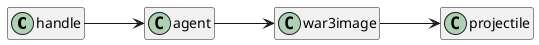

# projectile

```plantuml
@startuml
left to right direction

handle --> agent

agent --> war3image

war3image --> projectile

hide members
@enduml
```

Тип, используемый игрой для снарядов.

## Функции

<include from="native-projectile.md" element-id="main"/>